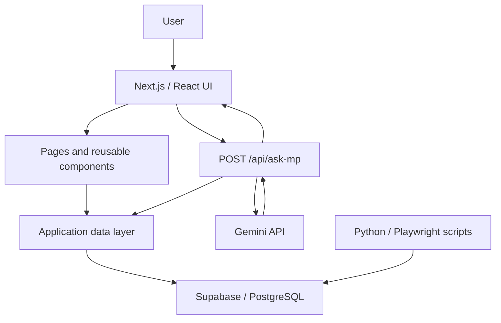

# MP Tracker

MP Tracker is a full-stack civic-technology application for exploring and understanding the parliamentary performance of Indian Members of Parliament (MPs). It brings together MP profiles, parliamentary activity, performance analytics, bill and question records, and MPLAD-related views in one accessible interface, with an AI assistant for natural-language exploration of verified data.

## Project Overview

The project turns dispersed parliamentary information into searchable, comparable, and visual MP profiles. Citizens can browse MPs by constituency, state, or party; inspect activity such as attendance, questions, debates, and bills; compare representatives; and explore analytical dashboards.

## Problem Statement

Parliamentary performance data is often distributed across multiple sources and presented in formats that are difficult to browse, compare, or interpret. This makes it harder for citizens to understand how their representatives participate in Parliament and to ask straightforward, data-grounded questions about them.

## Objectives

- Make parliamentary performance information easier to discover and understand.
- Present comparable MP-level metrics and supporting activity records.
- Provide constituency, state, party, and ranking views for broader context.
- Surface available MPLAD-related information in dedicated dashboards and analytics.
- Support natural-language questions while grounding responses in retrieved MP data.

## Key Features

- Searchable MP profiles with constituency, state, party, and performance information.
- Performance metrics including attendance, questions, debates, bills sponsored, bills passed, and an overall score where available.
- Detail pages for questions, debates, and bills, with source links where present.
- MP comparison, rankings, state, party, election, and dashboard views.
- Attendance and performance-history visualizations.
- MPLADS dashboards with recommended works, completed projects, expenditure, yearly trends, sector breakdowns, and utilisation-related summaries when data is available.
- A citizen-facing MP Assistant that answers supported questions about MP, state, party, comparison, ranking, and filtered-performance queries.

## Technology Stack

| Area | Technologies |
| --- | --- |
| Front end | Next.js, React, TypeScript |
| Styling | Tailwind CSS |
| Data and storage | Supabase, PostgreSQL |
| Data extraction | Python, Playwright, Beautiful Soup, pandas |
| AI integration | Google Gemini API / LLM via `@google/generative-ai` |
| Visualisation | D3 and Recharts |
| Development workflow | Git and GitHub |

## Data Extraction & Processing

The project includes Python-based extraction and import utilities for parliamentary and MP-related data. Playwright is used for browser-driven collection where pages require it; processing scripts normalize extracted records before importing them into Supabase.

The available pipeline covers MP profiles and parliamentary activity, including questions, debates, and bills. Separate MPLADS scripts collect and process MPLAD-related records. Supporting scripts are also used to enrich records, such as fetching MP photos and backfilling selected metadata.


## Database & Storage

Supabase provides the application data layer on PostgreSQL. The schema and application data access support MP records, performance history, topical data, bills, questions, debates, private member bills, and related activity data.

MPLAD-related data is stored separately for recommended works, completed projects, and expenditure. The project includes a materialized `mplad_mp_totals` view that aggregates sanctioned and utilised totals per MP for efficient read access; it is refreshed after the MPLAD import pipeline runs.

## System Architecture



## AI-Powered MP Assistant

The MP Assistant is implemented as a Next.js API route at `app/api/ask-mp/route.ts`. A user can ask a question such as:

> “How did the MP in Lucknow perform?”

The route retrieves MP data, resolves relevant entities such as a constituency, MP, state, or party, calculates the needed comparison or ranking context in TypeScript, and sends that verified context to Gemini for a concise response. The API also has a deterministic fallback response path if the LLM is unavailable.

```text
User Query
  → MP Assistant UI
  → Next.js API Route
  → Relevant MP/Data
  → Gemini/LLM
  → Response
```

The LLM is instructed to use the supplied verified database context as its source of truth rather than inventing statistics or rankings.

## AI-Assisted Development

AI coding tools were used as part of the development process for code generation, exploring implementation approaches, debugging, refactoring, understanding unfamiliar technologies, API integration, database/query debugging, and TypeScript/Next.js debugging.

AI output was reviewed, tested, and validated against the project requirements and application behaviour; it was not accepted blindly.

```text
Requirement
  → AI-assisted exploration
  → Implementation
  → Testing
  → Debugging
  → Review
  → Validation
```

## Challenges & Lessons Learned

- Integrating parliamentary data requires careful extraction, normalization, and source-aware handling of incomplete or differently formatted records.
- Reliable AI answers depend on resolving the intended MP, constituency, state, or party and calculating metrics before prompting the LLM.
- Data-heavy dashboards benefit from server-side aggregation: the MPLAD totals view is materialized to avoid expensive repeated aggregation queries.
- A useful public-data interface must communicate available metrics clearly without overstating what the underlying data can support.

## Project Structure

```text
tracker2.0-redesigned/
├── README.md
└── tracker2.0/
    ├── app/                  # Next.js routes, pages, and API endpoints
    │   └── api/ask-mp/       # MP Assistant API route
    ├── components/           # Reusable UI, analytics, MP, and MPLADS components
    ├── lib/                  # Supabase client, data access, utilities, translations
    ├── scripts/              # Python/Node extraction, import, and processing scripts
    ├── supabase/             # Database schema and MPLAD totals view SQL
    ├── public/               # Static assets
    └── package.json
```

## Screenshots

## Homepage

[ADD HOMEPAGE SCREENSHOT HERE]

## MP Profile

[ADD MP PROFILE SCREENSHOT HERE]

## AI Assistant

[ADD AI ASSISTANT SCREENSHOT HERE]

## Analytics

[ADD ANALYTICS SCREENSHOT HERE]

## Local Setup

### Prerequisites

- Node.js compatible with the project dependencies
- npm
- A Supabase project with the required schema and data
- A Google AI Studio API key for Gemini-powered answers
- Python 3 and Playwright for running the extraction scripts (optional for using the web app)

### Run the application

```bash
git clone <your-repository-url>
cd tracker2.0-redesigned/tracker2.0
npm install
cp .env.example .env.local
npm run dev
```

Open `http://localhost:3000` in your browser. If an `.env.example` file is not present, create `.env.local` with the variables listed below.

### Run extraction utilities

```bash
cd scripts
python -m venv .venv
# Activate the virtual environment for your shell
pip install -r requirements.txt
playwright install
```

Run the appropriate extraction or import script only after configuring its required Supabase environment variables.

## Environment Variables

Create `tracker2.0/.env.local` for local application configuration. Never commit real keys or service-role credentials.

```env
NEXT_PUBLIC_SUPABASE_URL=
NEXT_PUBLIC_SUPABASE_ANON_KEY=
GOOGLE_AI_STUDIO_API_KEY=
# Optional: defaults to the route's configured Gemini model
GEMINI_MODEL=
```

The data-import and maintenance scripts may additionally require server-side Supabase credentials, such as `SUPABASE_URL`, `SUPABASE_KEY`, or `SUPABASE_SERVICE_ROLE_KEY`. Keep these private and use them only in trusted local or server-side environments.

## Future Improvements

- Add automated extraction validation and scheduled refresh workflows.
- Expand data coverage and make data freshness visible to users.
- Add automated tests for entity resolution, metrics, API responses, and UI flows.
- Improve source provenance and citation display across activity records.
- Add richer accessibility, multilingual, and mobile UX refinements.
- Add monitored deployment and observability when production hosting is configured.

